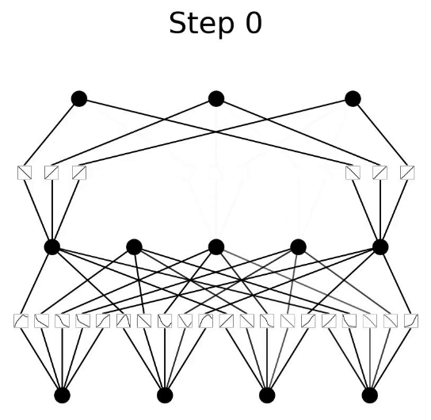

# Kolmogorov-Arnold Networks
Kolmogorov-Arnold Networks (KANs) for classification and regression tasks.

  

### Getting Started
All the necessary code and packages are contained within a Jupyter Notebook in this repository. Open either the classification or regression notebook and click run. 

If you would like to use a GPU on colab you can change this setting by selecting `Change Runtime Type -> GPU`, otherwise select `cpu`.

### Files
This repository contains the following files:
* `KAN_classification.ipynb` - A detailed Jupyter Notebook that will guide readers through how to make a KAN for classification.
* * `KAN_regression.ipynb` - A detailed Jupyter Notebook that will guide readers through how to make a KAN for regression.
